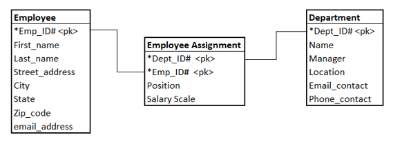

Each table will have a **primary key** that is a piece of data that is **unique** for every row. The primary key is what creates the **relationship** between the tables and why it’s called a **relational database**. In the examples above, there could be other tables that would be added to create the relationship.

SQL is the language that is used to retrieve data from one or more of the related tables. A **SQL query** is the statement you write to maintain the data in the database. It will be used to retrieve just the data that is needed (not just all rows and/or all columns). As you progress through these exercises, remember that you are just seeing and writing queries on one or more tables in a relational database made up of many tables.

SQL is one of those languages that is used by many different **Relational Database Management Systems** (RDBMS). The SQL queries you write in these exercises are transferable to the others with a few **syntax** (grammar) and other differences. 

There’s a lot more to database design that in this simple explanation. This is just what you need to go through the rest of the course, progressing through these real-world examples.
